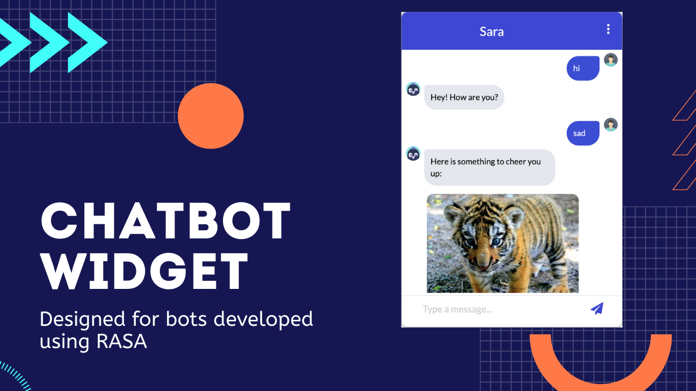

  ***An Open Source ChatBot widget easy to connect to RASA bot through [Rest](https://rasa.com/docs/rasa/user-guide/connectors/your-own-website/#rest-channels) Channel.***

## Features

- Text 
- Markdown
- Buttons
- Images
- Video 
- PDF Attachment
- Dropdown
- Quick replies
- Cards carousel
- Charts
- Collapsible
- Bot typing indicator
- Location access

## Instructions
- You can read the instructions here in [instructions.md](docs/instructions.md)

## Documentation
- Check out the documentation on how to send bot response from Rasa in [response.md](docs/responses.md)
- If you want to modify the UI elements, you can read on how to do here: [modifications.md](docs/modifications.md)

## Gallery:
- Check out the sample pics here [gallyery.md](docs/gallery.md)

## Sample Bots:
Below are the sample bot projects that were developed using Rasa and made to work with this widget
- [Restaurant Search Bot](https://github.com/JiteshGaikwad/Restaurant-Search-Bot.git)
- [HR Bot](https://github.com/JiteshGaikwad/HR_Bot)

## Library used:
- [Materialize CSS](https://materializecss.com) for CSS
- [Showdownjs](https://github.com/showdownjs/showdown) for Markdown suppport
- [Chart.js](https://www.chartjs.org/) for Charts

## Demo:

Check out the widget in action here [demo](https://www.youtube.com/watch?v=mnolLtOWykk)

Changes in code
========================

(1)  we have create a new function "ksend()" in "chat.js"(Uimain/static/js/components/chat.js) file. where we have put the url of kiryanwanda language.(line no 288-320)

         function ksend(message) {
             $.ajax({
                 url: "http://irinde.rwandawomennetwork.org/webhooks/rest/webhook",
                 type: "POST",
                 contentType: "application/json",
                 data: JSON.stringify({ message, sender: sender_id }),
                 success(botResponse, status) {
                     console.log("Response from Rasa: ", botResponse, "\nStatus: ", status);

                     // if user wants to restart the chat and clear the existing chat contents
                     if (message.toLowerCase() === "/restart") {
                         $("#userInput").prop("disabled", false);

                         // if you want the bot to start the conversation after restart
                         // customActionTrigger();
                         return;
                     }
                     setBotResponse(botResponse);
                 },
                 error(xhr, textStatus) {
                     if (message.toLowerCase() === "/restart") {
                         $("#userInput").prop("disabled", false);
                         // if you want the bot to start the conversation after the restart action.
                         // actionTrigger();
                         // return;
                     }

                     // if there is no response from rasa server, set error bot response
                     setBotResponse("");
                     console.log("Error from bot end: ", textStatus);
                 },
             });
         }

(2)  write some logic in "chat.js" for which fuction will call if we select language english or kiryanwanda(line no 488-499)

        if (selectlang === "english") {
                console.log("english trigger in sendbutton")
                setUserResponse(text);
                send(text);
                e.preventDefault();
            }
            // if you want to chat in kinyarwanda
            else if (selectlang === "kinyarwanda") {
                console.log("kinyarwanda trigger in sendbutton")
                setUserResponse(text);
                ksend(text);
                e.preventDefault();
            }

(3)  also write some code in the last of "chat.js", code which is given below(line no 504-513)

          $("#english").on("click", (e) => {
              selectlang = "english";
              $('.langselect').hide();
              $(".keypad").show();
          });
          $("#Kiryawanda").on("click", (e) => {
              selectlang = "kinyarwanda";
              $('.langselect').hide();
              $(".keypad").show();
          });

(4)  also put one condition in "suggestionButton.js" (line no 31-39)

         if(selectlang === "english"){
                 setUserResponse(text);
                 send(payload);   
             }
             // if suggestions button you want in kinyarwanda
             else if(selectlang === "kinyarwanda"){
                 setUserResponse(text);
                 ksend(payload);
             }

